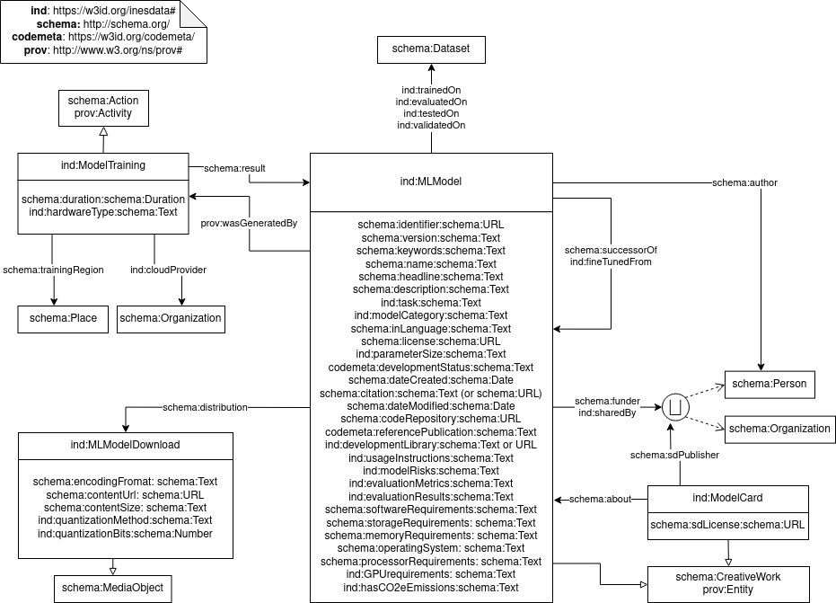

# inesdata-ml-schema 

A repository to keep the vocabulary for datasets and models developed in Inesdata project. The goal is to have a lightweight vocabulary with a model-centric view of ML models. The vocabulary extends [schema.org](http://schema.org) and [Codemeta](https://w3id.org/codemeta).

This vocabulary aims to be compatible with the efforts from the [FAIR4ML RDA community](https://github.com/zbmed-semtec/m4ml) which are under discussion.

- **Authors**: Daniel Garijo, Patricia Martin-Chozas, Carlos Ruiz
- **License**: Apache 2.0
- **Version**: 0.0.1
- **Status**: Draft
- **Latest version URI**: `https://w3id.org/inesdata#` (not yet functional)
- **This version URI**: `https://w3id.org/inesdata/0.0.1#` (not yet functional)
- **prefix**: `ind`
- **Date**: Dec 28th, 2023

## Overview
The following diagram shows the classes, properties and data properties of the inesdata ml schema. Note that a union has been used for classes like author and funder to denote that the domain/ranges includes both classes.

## Prefixes

- `ind`: [https://w3id.org/inesdata#](https://w3id.org/inesdata#)
- `schema`: [http://schema.org](http://schema.org)
- `codemeta`: [https://w3id.org/codemeta](https://w3id.org/codemeta)
- `prov`: [http://www.w3.org/ns/prov#](http://www.w3.org/ns/prov#)

## Classes

### Machine Learning Model Download (ind:MLModelDownload)
Class representing a downloadable ML model object (models may be distributed in different sized and quantizations)

### Model Card (ind:ModelCard)
Class aimed at representing metadata records for ML models.

### Executable Machine Learning Model (ind:MLModel)
Class to represent Machine Learning models that can be run for some task (e.g., those available in HuggingFace). A Machine Learning model may have more than one model distribution

### Model Training Activity (ind:ModelTraining)
Action/Activity identifying that a model was trained, and its circumstances (training hours, hardware used, etc.)

## Properties

### cloud provider (ind:cloudProvider)
Organization who provided the cloud infrastructure to train the model (e.g., Amazon)

- Domain: [ind:ModelTraining](#model-training-activity-indmodeltraining)
- Range: [schema:Organization](http://schema.org/Organization)

### evaluated on (ind:evaluatedOn)
Dataset used for evaluating the model. The dataset used for evaluation may not have been part of the train/test/validation (e.g., a benchmark)

- Domain: [ind:MLModel](#executable-machine-learning-model-indmlmodel)
- Range: [schema:Dataset](http://schema.org/Dataset)

### evaluation metrics (ind:evaluationMetrics)
Description of the metrics used for evaluating the ML model

- Domain: [ind:MLModel](#executable-machine-learning-model-indmlmodel)
- Range: [schema:Text](http://schema.org/Text)

### evaluation results (ind:evaluationResults)
Description of the evaluation results obtained from the model (comparison, metric tables, etc.)

- Domain: [ind:MLModel](#executable-machine-learning-model-indmlmodel)
- Range: [schema:Text](http://schema.org/Text)

### fine tuned from(ind:fineTunedFrom)
Relationship to point to the source model used for fine tuning (if this model was finetuned from another one)

- Domain: [ind:MLModel](#executable-machine-learning-model-indmlmodel)
- Range: [ind:MLModel](#executable-machine-learning-model-indmlmodel)

### GPU requirements (ind:GPURequirements)
Description of the GPU requirements needed to run the model

- Domain: [ind:MLModel](#executable-machine-learning-model-indmlmodel)
- Range: [schema:Text](http://schema.org/Text)

### hardware type (ind:hardwareType)
Description of the type of hardware used when training the model, so it can be used to report emissions.
- Domain: [ind:ModelTraining](#model-training-activity-indmodeltraining)
- Range: [schema:Text](http://schema.org/Text)

### ()
- Domain: 
- Range

### ()
- Domain: 
- Range

### ()
- Domain: 
- Range

### ()
- Domain: 
- Range